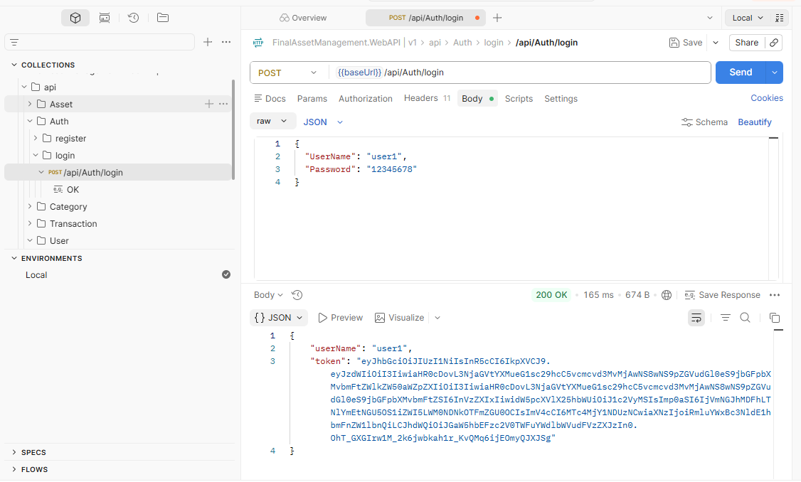
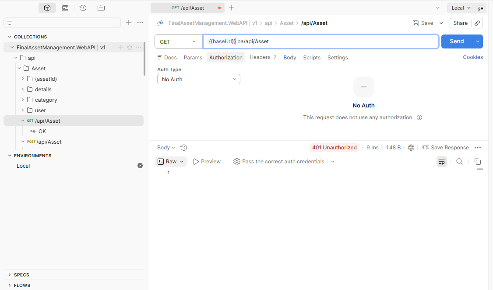
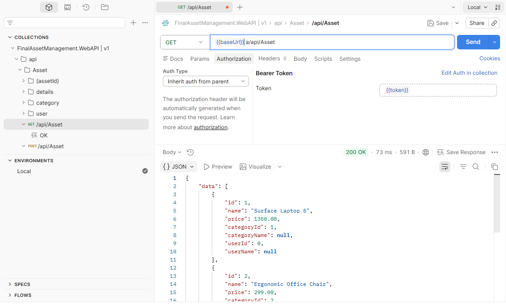

# 🚀 FinalAssetManagement 🚀

An **Asset Management RESTful API** built with **ASP.NET Core (.NET 10)**.  
This project follows **Clean Architecture (Onion Architecture)** to ensure high maintainability, scalability, and separation of concerns.

---

## ✨ Key Features

- 🏗 **Clean Architecture** — Strict separation between Domain, Application, Infrastructure, and API layers  
- 🔁 **Repository & Unit of Work Pattern** — Structured data access management  
- 🛡 **JWT Authentication** — Secure role‑based authorization  
- 📦 **Entity Framework Core (Code‑First)** — Database schema managed with migrations  
- 🎨 **AutoMapper** — Simplified object mapping between layers  
- ✅ **FluentValidation** — Structured request validation  
- ⚡ **Standardized API Responses** — Unified response structure for all endpoints  

---

## 🏗 Architecture Overview

This project follows **Onion Architecture**, where dependencies always point inward toward the Domain layer.

📖 **Detailed explanation:**  
[Architecture Documentation](docs/architecture.md)

---

## 🗄 Database Design

The database schema supports asset tracking, user management, and system configuration.

📖 **Detailed documentation:**  
[Database Documentation](docs/database.md)

---

## ⚙️ API Usage

The API uses **JWT authentication** and can be tested with **Postman** or **Swagger**.

### 🔐 Authentication Example

| Login API | Unauthorized Response |
|:---------:|:--------------------:|
|  |  |

### 📦 Asset Endpoint Example

📖 **Full guide:**  
[API Usage Documentation](docs/api-usage.md)

---

## 📂 Project Structure

FinalAssetManagement  
│  
├── FinalAssetManagement.Application  
├── FinalAssetManagement.Contract  
├── FinalAssetManagement.Core  
├── FinalAssetManagement.Infrastructure  
├── FinalAssetManagement.WebAPI  
├── FinalAssetManagement.WebApplication  
│  
├── docs  
│   ├── architecture.md  
│   ├── database.md  
│   └── api-usage.md  
│  
├── images  
│   ├── architecture-diagram.png  
│   ├── DatabaseDiagram.png  
│   ├── login-api.png  
│   ├── unauthorized.PNG  
│   └── get-assets.png  
│  
├── README.md  
├── CHANGELOG.md  
├── LICENSE  
└── FinalAssetManagement.slnx  

---

## 🛠 Getting Started

### ✅ Prerequisites

- .NET SDK 10  
- SQL Server  

### 🚀 Installation

Clone the repository:

git clone https://github.com/ensiehyousefi14/FinalAssetManagement.git  
cd FinalAssetManagement  

Configure the database connection string:

FinalAssetManagement.WebAPI/appsettings.json  

Apply database migrations:

dotnet ef database update --project FinalAssetManagement.Infrastructure --startup-project FinalAssetManagement.WebAPI  

Run the project:

dotnet run --project FinalAssetManagement.WebAPI  

---

## 📚 Documentation

Detailed documentation is available in the **docs** folder:

- Architecture → docs/architecture.md  
- Database Schema → docs/database.md  
- API Usage → docs/api-usage.md  

---

## 🤝 Contribution

Contributions are welcome.  
If you find issues or want to propose improvements, feel free to open an **Issue** or submit a **Pull Request**.

---

## ⚖️ License

This project is licensed under the **MIT License**.

---

Developed by ❤️ Ensieh Yousefi
