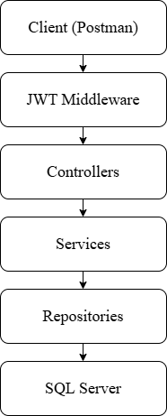

# 🏗️ Project Architecture

This project is built using the principles of **Clean Architecture** (specifically **Onion Architecture**). This design ensures a strict separation of concerns, making the system highly maintainable, testable, and independent of external frameworks or databases.

## Architecture Diagram
Below is the visual representation of the layer dependencies. Dependencies point inwards, meaning core layers do not know about outer layers.

## Core Principles
1. **Independence of Database:** The core business logic is not coupled to EF Core or SQL Server. They are treated as external details.
2. **Testability:** Business rules can be easily unit-tested without external UI or Database dependencies.
3. **Independence of Frameworks:** The Application core does not rely on Web API packages or controllers.
