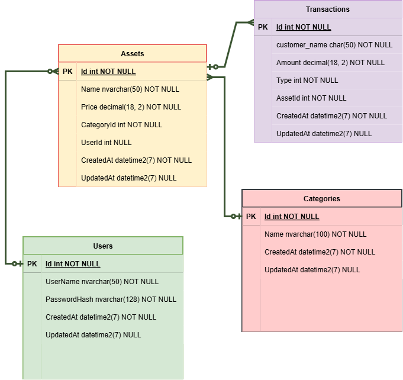

# 🗄️ Database Schema

The database design focuses on tracking assets efficiently, maintaining historical records, and securing user roles. 

## Entity-Relationship Diagram (ERD)
The database structure contains relationships for assets, users, and core configurations. Below is the detailed schema layout:

## Core Database Patterns
- **Entity Framework Core (Code-First):** The database schema is fully generated and managed using EF Core migrations.
- **Cascading & Constraints:** Hard constraints are applied at the database level to maintain data integrity.
